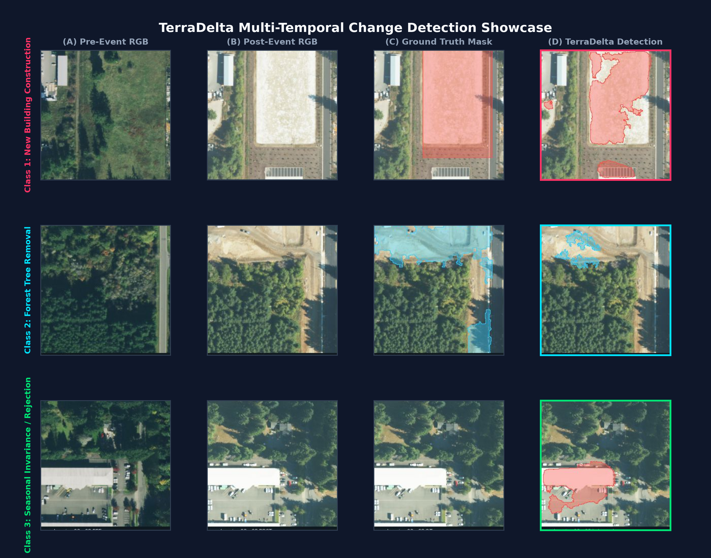
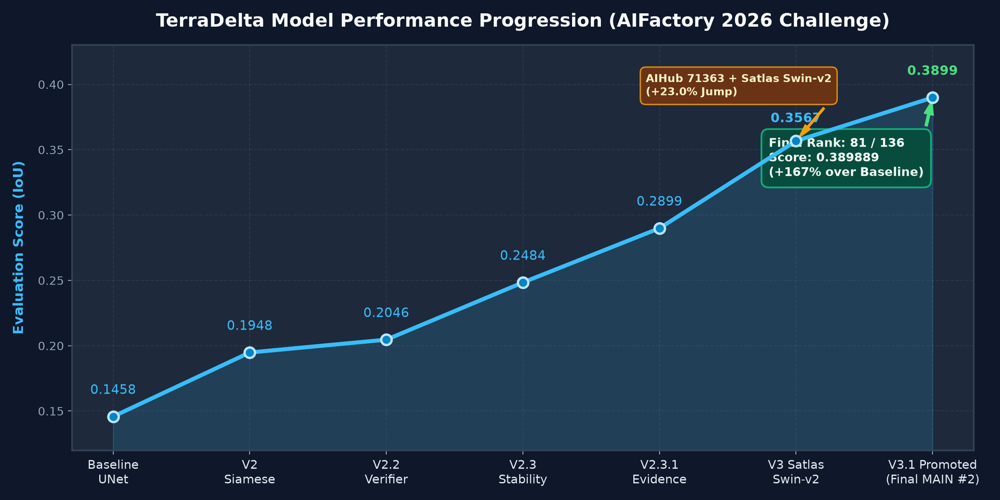
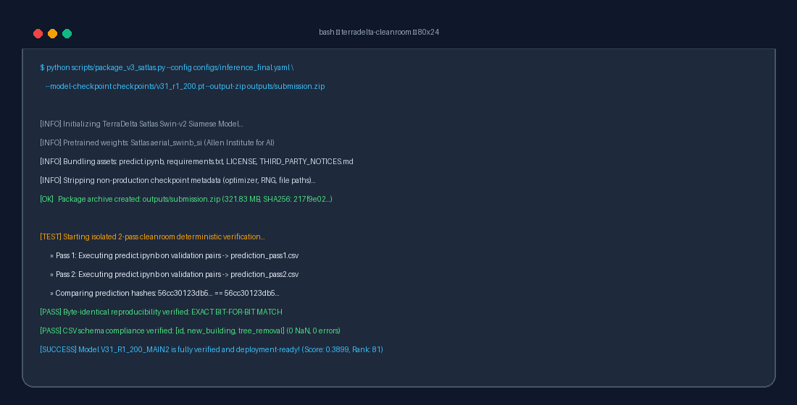

# TerraDelta: Satellite Change Detection for National Park Monitoring

[](LICENSE)
[](https://www.python.org/)
[](#project-status)
[](docs/v31-final-result.json)
[](docs/v31-final-result.json)

**TerraDelta** is an end-to-end deep learning change detection pipeline developed for the **[2026 National Park Satellite Monitoring AI Challenge](https://aifactory.space/ko/competitions/9306)** (Track 3: Illegal Building & Tree Removal Detection).

The system accepts high-resolution pre-event and post-event satellite/aerial RGB imagery pairs, detects newly constructed illegal buildings and unauthorized tree removals, and generates standardized pixel-coordinate vector polygons.



---

## Project Status

> [!NOTE]
> **Competition Concluded:** This project successfully concluded following the official submission deadline on October 6, 2026. This repository is maintained in a concluded/read-only state for open-source reference, documentation, and methodology dissemination. Non-breaking documentation updates and issues remain permitted.

---

## Key Results & Leaderboard Progression



| Milestone / Version | Submission ID | Model Architecture | Submission Mode | Score (IoU Metric) | Leaderboard Rank |
|:---|:---:|:---|:---:|:---:|:---:|
| **Baseline UNet** | 364413 | ResNet-18 UNet 6-Channel Early Fusion | Practice/DEBUG | `0.1458` | — |
| **V2 Siamese** | 364648 | Siamese ResNet-18 Siamese Difference | MAIN | `0.194790` | 128 / 136 |
| **V2.2 Verifier** | 365047 | Frozen Siamese + Post-hoc Verifier | Practice/DEBUG | `0.204595` | — |
| **V2.3 Stability** | 365654 | TTA Component Persistence Matching | MAIN | `0.248421` | — |
| **V2.3.1 Evidence** | 365922 | Object-Level Evidence Classifier | Practice/DEBUG | `0.289924` | 113 / 136 |
| **V3 Satlas Swin** | 366045 | Satlas Swin-v2 Siamese + AIHub 71363 (S2-800) | MAIN #1 | `0.356727` | 85 / 136 |
| **V3.1 Promoted (Final)** | **366232** | **Satlas Swin-v2 Siamese + FPN (`V31_R1_200_MAIN2`)** | **MAIN #2** | **`0.389889`** | **81 / 136** |

---

## Final Model Architecture: `V31_R1_200_MAIN2`

The final promoted model achieves peak performance by replacing naive early-fusion convolutional networks with a geospatial foundation backbone and dual-branch Siamese representation learning:

```text
Pre-event RGB  ──┐
                 ├── Shared Swin-v2 Backbone (SatlasPretrain aerial_swinb_si) ──┐
Post-event RGB ──┘                                                             ├── Multi-Scale FPN ──┬── Building Head (256x256)
                                                                               │                     └── Tree Head (256x256)
                                                                               └── Global Presence ──┬── Building Presence Logit
                                                                                                     └── Tree Presence Logit
```

### 1. Foundation Encoder
- **Backbone:** Shared-weight Swin Transformer V2 Base (`aerial_swinb_si`), pretrained on extensive multi-sensor aerial imagery by the Allen Institute for AI (SatlasPretrain).
- **Scale Invariance:** 4-stage hierarchical feature representations extracted at 1/4, 1/8, 1/16, and 1/32 resolutions.

### 2. Temporal Fusion & Decoding
- Feature fusion modules compute differential and cross-temporal attention maps at every pyramid stage.
- Top-down Feature Pyramid Network (FPN) with lateral skip connections aggregates multi-resolution semantic features into a unified 128-channel representation.

### 3. Independent Class Thresholding
Rather than enforcing a mutually exclusive softmax partition (which artificially penalizes overlapping tree felling and construction boundaries), the post-processor evaluates classes independently using calibrated probability and presence gates:

| Class | Pixel Probability Threshold | Presence Logit Gate | Minimum Polygon Area | Polygon Simplification |
|:---|:---:|:---:|:---:|:---:|
| **`new_building`** | `0.35` | `0.30` | 30 px | 0.5 px (Douglas-Peucker) |
| **`tree_removal`** | `0.70` | `0.30` | 20 px | 0.5 px (Douglas-Peucker) |

---

## Repository Structure

```text
terra-delta/
├── configs/
│   └── inference_final.yaml      # Pinned V31_R1_200_MAIN2 inference & threshold configuration
├── docs/                         # Detailed experiment reports, data audits, and validation records
│   └── v31-final-result.json     # Machine-readable final competition & submission receipt
├── scripts/
│   ├── package_v3_satlas.py      # Offline submission packager with cleanroom 2-pass verification
│   ├── prepare_v3_datasets.py    # Training crop extraction & manifest generator
│   └── run_v3_experiments.py     # Reproducible experiment orchestrator
├── src/
│   └── terradelta/
│       ├── data/                 # Dataset loaders, transforms, and temporal pairing
│       ├── inference/            # Predictors, postprocessing, polygon serialization
│       ├── metrics/              # Competition IoU, F1, and polygon evaluation helpers
│       ├── models/               # Satlas Swin-v2 Siamese architecture implementation
│       └── postprocess/          # Mask-to-polygon, polygon simplification, area filtering
├── tests/                        # Comprehensive unit and integration test suite
├── THIRD_PARTY_NOTICES.md        # Upstream notices (Satlas Apache-2.0, Baseline terms)
├── LICENSE                       # MIT License
└── pyproject.toml                # Project packaging and dependency specifications
```

---

## Installation & Setup

### Requirements
- Linux (x86_64)
- Python `>= 3.10`
- CUDA 12.x or CPU execution

### Setup via pip / virtualenv
```bash
git clone https://github.com/seohuda/terra-delta.git
cd terra-delta

python3 -m venv .venv
source .venv/bin/activate
pip install -e .
```

### Running Tests
All unit tests and package contracts can be executed offline without proprietary checkpoints:
```bash
pytest tests/ -v
```

---

## Reproducing Submission Packaging & Cleanroom Verification

TerraDelta enforces strict **2-pass byte-identical verification** to guarantee deterministic execution before any submission archive is created:



```bash
python scripts/package_v3_satlas.py \
    --model-checkpoint /path/to/model.pt \
    --config configs/inference_final.yaml \
    --test-manifest /path/to/validation_pairs.csv \
    --output-zip outputs/terradelta-final-submission.zip
```

The packager validates that:
1. All absolute local or personal paths are purged from bundled notebooks.
2. Inference executed twice on synthetic or validation inputs produces bit-for-bit identical prediction CSV files.
3. Prediction CSVs conform strictly to the required competition schema (`id`, `new_building`, `tree_removal`).
4. Necessary license notices (`LICENSE`, `THIRD_PARTY_NOTICES.md`) are bundled inside the archive.

---

## Data Acquisition & Provenance

### 1. Challenge Dataset
- Provided exclusively to participants of the **2026 National Park Satellite Monitoring AI Challenge** by AIFactory and Korea National Park Service.
- In accordance with challenge rules, competition test sets and proprietary annotations are not distributed in this repository.

### 2. Auxiliary Dataset (AIHub 71363)
- Multi-temporal high-resolution imagery was sourced from AIHub Dataset 71363 (*Forest Tree Species and Forest Change Detection Imagery*) via authorized domestic access.
- In compliance with AIHub Terms of Service, raw imagery, crops, and derived model weights are not hosted publicly.

---

## Limitations & Known Challenges

1. **Mountainous Topography & Shadowing:** Complex mountain terrain in Korean national parks introduces significant seasonal and sun-angle shadow variance between pre- and post-event images, occasionally causing false positive canopy change detections.
2. **Class Imbalance:** Tree removal events outnumber building changes in protected natural areas, requiring conservative pixel thresholds (`0.70`) on tree removal to protect precision against natural canopy phenology shifts.
3. **Sensor Discrepancies:** Pairings between satellite sensors with differing Ground Sample Distance (GSD) or spectral response curves require robust spatial registration and intensity normalization.

---

## License & Intellectual Property

- **Source Code and Documentation:** Distributed under the [MIT License](LICENSE) &copy; 2026 seohuda.
- **Third-Party Components:**
  - SatlasPretrain model utilities: [Apache License 2.0](third_party/satlaspretrain_models.LICENSE) (c) 2023 Allen Institute for AI.
  - Baseline competition evaluation helpers: AIFactory / Korea National Park Service.
  - See [`THIRD_PARTY_NOTICES.md`](THIRD_PARTY_NOTICES.md) for full terms and attributions.
- **Weights & Data Exclusion:** The MIT License applies strictly to the source code and documentation. It does **not** grant rights to, nor distribute, proprietary challenge test sets, AIHub source imagery, or trained model parameter checkpoints.
