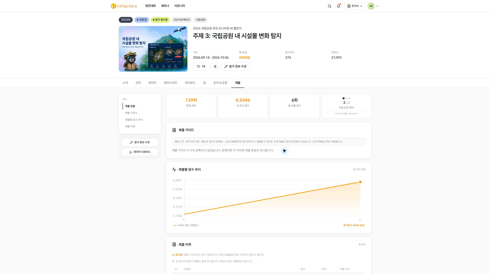
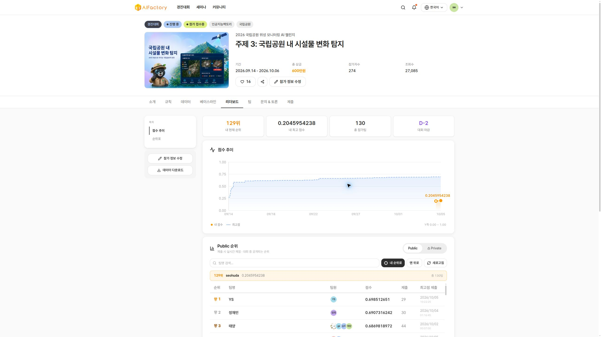

# V2.2 MAIN: KEEP

The unchanged v2.2 verifier package completed one MAIN submission with public
score **0.2045954238**, compared with frozen v2 **0.1947902971**. The absolute
gain is **0.0098051267** (5.0337% relative). Rank was **129** when observed,
versus 130 immediately before this submission. Keep v2.2 on this public result;
the private score is not available. Frozen v2 remains preserved as the reference.

| Field | Verified result |
| --- | --- |
| Source branch | `v2.2-verifier-aihub-20261005` |
| Inference source commit | `099c1e968d9faaf2c33894ad55da32667d16092a` |
| Model name | `MAIN_TERRADELTA_V22_VERIFIER_01` |
| Public / private submission ID | 365058 / 365059 |
| Code run ID | 32093 |
| Terminal status | Completed (`완료`) |
| Registered at | 2026-10-05T01:37:07.583011+00:00 |
| Server submission time | 2026-10-05 10:37:08 KST |
| Completion observed at | 2026-10-05T01:44:42.692Z |
| MAIN used / remaining | 1 / 2 of 3 on 2026-10-05 KST |
| Additional MAIN authorization | 0 |
| Previous DEBUG | 365047 / run 32072, completed, displayed 0.3331 |
| Frozen release | `/data/terradelta/releases/v2.2-main-01/` |

The server completion timestamp and execution duration are not exposed in the
observed UI. The completion observation is not a server timestamp or runtime.
Full precision public score comes from the authenticated leaderboard; submission
history displays 0.2046. Detailed server logs and prediction CSV are unavailable.
See [the machine-readable result](v22-main-result.json).

## Unchanged artifact and preflight

The exact 60,019,810-byte ZIP previously submitted for DEBUG was uploaded directly
from the existing Seoul CPU EC2 instance. No ZIP, weights or data were downloaded
to the user's computer. The DEBUG and MAIN inference bytes are identical; only
the SDK submission mode differs. All 25 ZIP entries match the previous DEBUG
manifest, including the retained LICENSE and NOTICE. Data, credentials, training
files and logs are excluded from the ZIP.

| Artifact | SHA-256 |
| --- | --- |
| ZIP | `f4bcaa54157fe077318f9c0bef43d764bab3c14daa86c52a1f566213169d79c2` |
| Checkpoint | `ca59fe6698d8ee6bef354a7f40c1ef6d8901826e0572a5b80eb2b1d8b2ca4372` |
| Config | `0e0fd4bf695af2ef7c2b2aff9c5dc3b91babb1d4569f54b6ac416122ef9a1f77` |
| Verifier | `2b7a0a1727d7bc30a6944b2d49f20252adf038118ad217d626c6fc3d117ad97a` |

Verifier hash is sorted compact JSON plus LF, extracted from the unchanged
embedded config. Packaged inference code matches source commit 099c1e9.
Two fresh extracted offline CPU runs passed on 32 pairs each, with network,
optimizer and backward calls blocked. Schema, IDs, finite bounded polygons,
class independence and CPU fallback passed. Both CSVs are byte-identical to each
other and to the previous DEBUG cleanroom CSV. No training, refit, threshold
change, AIHub download or frozen-v2 modification occurred during this task.
See [preflight](v22-main-preflight.json) and
[offline proof](v22-main-offline-manifest.json).

## Exactly one external MAIN registration

A local transport guard initially required explicit `debug:false`, while the
SDK omits the flag for MAIN. Its assertion failed before any network call:
zero upload requests, registrations or quota consumed. The guard was corrected
and mock-tested with duplicate and DEBUG rejection. Original incident markers
remain on EBS. The corrected dispatch made one upload-URL request and one
registration request. There was no external retry, error resubmission, second
MAIN or alternate artifact. The terminal portal confirms daily MAIN remaining
2/3 and DEBUG used 1/10.

## Freeze and AWS cleanup

The new release contains the exact ZIP, standalone checkpoint, config, verifier,
source SHA, previous DEBUG result/manifest, MAIN registration/result, preflight,
offline proof and SHA256 inventory. Fifteen files were hashed and verified;
all files are read-only and the release directory mode is 0555. The original
`v2-main-01` release's 33 indexed files still match their hashes. See
[freeze receipt](v22-main-freeze-receipt.json).

The task SSH authorization was removed, EBS synced and task SSM forwarding
termination requested; no active session remains and the local forwarding process
exited. AWS records the session as Terminating. CPU `i-0766a472ecb5bcf88` and GPU `i-0523a619699a95db0` are stopped.
The original encrypted 30 GiB volumes `vol-0070845086ec08190` and
`vol-084ec2fa143c670d6` remain attached with DeleteOnTermination=false.
Original data, weights and caches are retained. No GPU start, new instance,
volume, resize or snapshot was used. See
[final AWS proof](v22-main-aws-final.json).

