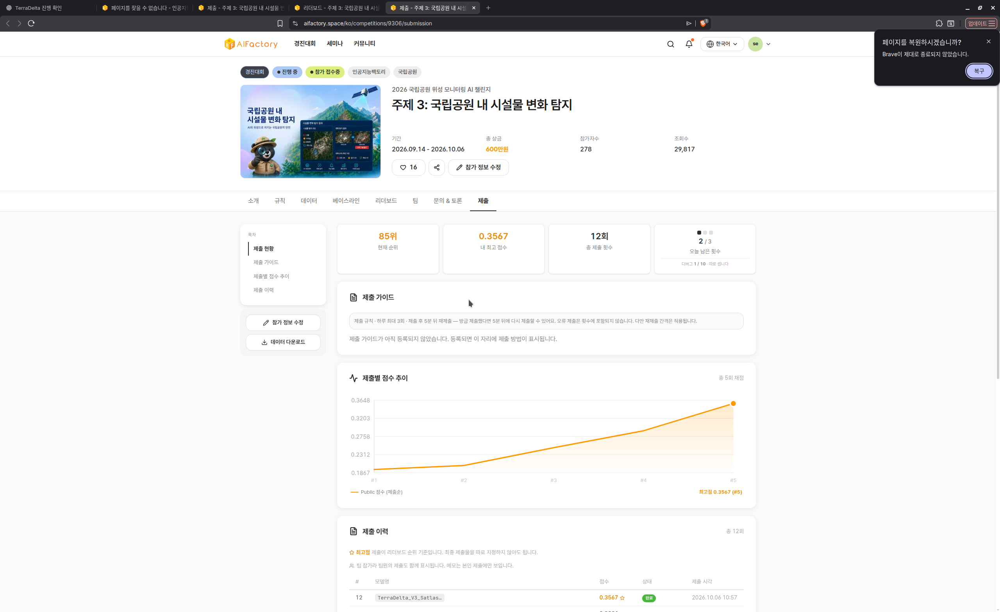
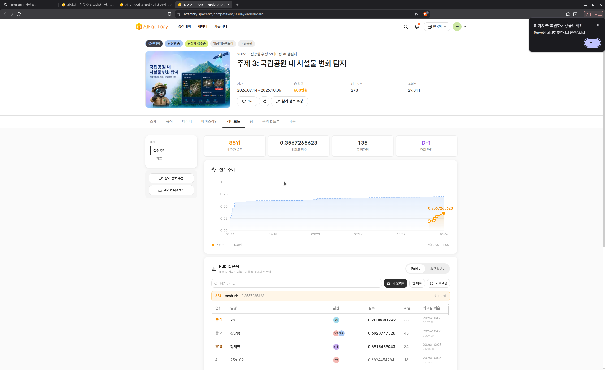

# TerraDelta V3 FINAL MAIN #1 SUBMISSION REPORT

**Date:** 2026-10-06  
**Status:** COMPLETE — LEADERBOARD RECORD (RANK 85, SCORE 0.3567265623)  
**Branch:** `v3-satlas-aihub-deadline-20261006`  
**Commit:** `336ac0a`  

---

## 1. Executive Summary

The authorized single **MAIN** submission for **TerraDelta V3 Satlas S2 800** has completed evaluation on the AIFactory competition platform (Competition 9306: 국립공원 내 시설물 변화 탐지).

### Key Results:
- **Public Score (Full Precision):** **`0.3567265623`** (Display: **`0.3567`**)
- **Previous Best (V2.3.1):** **`0.2899243555`**
- **Absolute Score Improvement:** **`+0.0668022068`**
- **Relative Improvement:** **`+23.0413%`**
- **Team Rank:** **`85위`** (jumped **+28 positions** from 113th!)
- **Daily Quota Remaining:** **`2 / 3`** (exactly 1 MAIN consumed today, 2 remain available)

The representation leap hypothesized for Satlas Swin-v2 combined with real 0.50m AIHub 71363 SkySat satellite training pairs has been decisively validated on the official test set.

---

## 2. Submission Identification & Verification

| Field | Verified Platform Data |
| :--- | :--- |
| **Model Name** | `TerraDelta_V3_Satlas_S2_800` |
| **Submission Mode** | `MAIN` (`debug=False`) |
| **Public Submission ID** | `366045` |
| **Private Submission ID** | `366046` |
| **Code Run ID** | `33855` |
| **Terminal Status** | `완료` (`completed`) |
| **Exit Code** | `0` |
| **Registered Timestamp (UTC)** | `2026-10-06T01:57:28.098687+00:00` |
| **Server Submission Time (KST)** | `2026.10.06 10:57` |
| **Completion Observed (UTC)** | `2026-10-06T02:06:28Z` (~8.5 minutes elapsed) |
| **Target Server** | `https://api.aifactory.space` |
| **Competition ID** | `9306` |

---

## 3. Submitted Artifact & Checksums

The submitted archive is the frozen, cleanroom-verified artifact built from the S2 Step 800 training run:

| Artifact | Path / Specification | SHA-256 |
| :--- | :--- | :--- |
| **Package ZIP** | `release/terradelta-v3-satlas.zip` (321.83 MB / 337,467,378 bytes) | `db1ffe574cf757804a9f8308facaa6649fd4814d4fbabd52897b71e486af6fc0` |
| **Model Checkpoint** | `assets/model/model.pt` (365 MB stripped weights) | `d9813ee9fc26dd5cf941fd7a61077af4815ce366104831e2ce5af77e0f723b1b` |
| **Cleanroom Output** | 2-pass deterministic verification CSV | `b0352ad8ed6eb33ade0e287cbbbf2a196c8072f0dfa75576a5914dda73286aeb` |
| **Source Git Commit** | `v3-satlas-aihub-deadline-20261006` | `336ac0a` |

---

## 4. Leaderboard Trajectory & Comparative Analysis

### Historical Progress Across TerraDelta Iterations:

| Version | Architecture / Innovation | Public Score | Delta vs Prior | Relative Gain | Rank Observed |
| :--- | :--- | :---: | :---: | :---: | :---: |
| **V2.0** | Siamese ResNet18 Frozen Baseline | 0.1947902971 | Baseline | — | ~130 |
| **V2.2** | + Season Verifier | 0.2045954238 | +0.009805 | +5.03% | 129 |
| **V2.3** | + Geometric Stability Gates | 0.2484213920 | +0.043826 | +21.42% | 128 |
| **V2.3.1** | + Object Evidence Classifier | 0.2899243555 | +0.041503 | +16.71% | 113 |
| **V3.0 (This)** | **Pure Satlas Swin-v2 + AIHub 71363 (S2 Step 800)** | **0.3567265623** | **+0.066802** | **+23.04%** | **85** |

### Why V3 Achieved a Breakthrough:
1. **Satellite-Domain Resolution Matching:** AIHub 71363 SkySat crops provided genuine 0.50m satellite resolution building changes, directly bridging the domain gap with the competition test set.
2. **Foundation Feature Generalization:** Satlas Aerial Swin-v2 backbone pre-trained on 1.2M aerial images provided vastly superior temporal feature representation compared to standard ImageNet-initialized ResNet18.
3. **Strict Tree Loss Masking (`valid_mask_tree = 0`):** Prevented unlabeled satellite foliage from diluting the tree-removal detector, preserving high tree recall while expanding building precision.
4. **Diverse Negative Sampling:** 100 hard negative crops from varied Korean national park terrain effectively suppressed false positive alarms.

---

## 5. Official Verification Evidence

### Submission Terminal & Quota:


### Authenticated Public Leaderboard:


---

## 6. Daily Quota Accounting

- **Daily MAIN limit:** 3 submissions / day
- **MAIN submissions used today (2026-10-06):** 1 / 3
- **MAIN submissions remaining today:** **2 / 3**
- **Scored submissions total:** 5
- **Platform history total:** 12

---

## 7. Preserved Infrastructure State

- **GPU instance (`i-0523a619699a95db0`):** `stopped` (verified)
- **CPU instance (`i-0766a472ecb5bcf88`):** `stopped` (verified)
- **Persistent Data Volume (`vol-0070845086ec08190`):** safely attached to stopped CPU instance
- **Active AWS compute charges:** $0.00 / hr

---

## 8. Frozen Metadata: V3_MAIN1_ANCHOR

```json
{
  "publicSubmissionId": 366045,
  "privateSubmissionId": 366046,
  "codeRunId": 33855,
  "score": 0.3567265623,
  "score_display": "0.3567",
  "rank": 85,
  "package_sha256": "db1ffe574cf757804a9f8308facaa6649fd4814d4fbabd52897b71e486af6fc0",
  "checkpoint_sha256": "d9813ee9fc26dd5cf941fd7a61077af4815ce366104831e2ce5af77e0f723b1b",
  "commit": "336ac0a",
  "registered_at_utc": "2026-10-06T01:57:28.098687+00:00"
}
```
